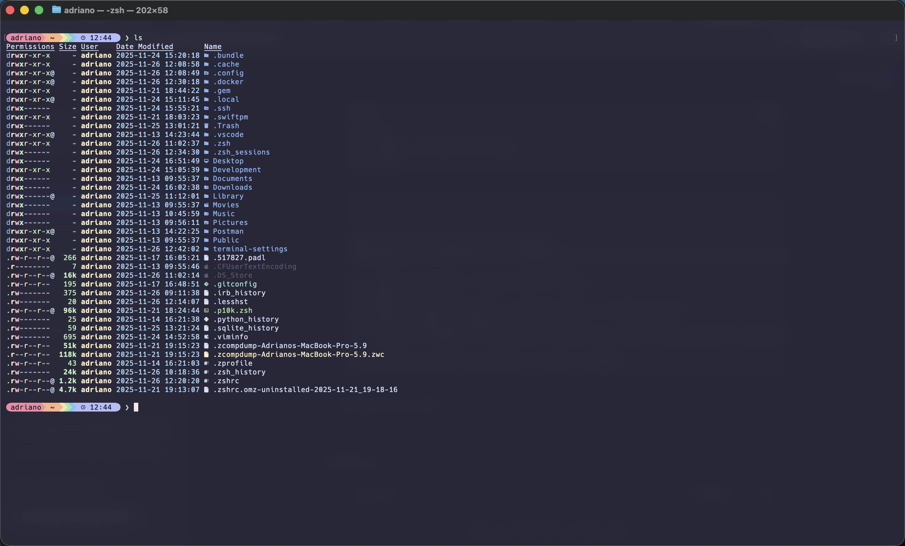

🚀 Terminal Settings (macOS)



Minha configuração pessoal de ambiente de desenvolvimento para macOS. Focada em **produtividade**, **estética** e **performance**.

Este setup substitui ferramentas antigas do terminal (como `ls`, `cat`, `nano`) por alternativas modernas e rápidas escritas em Rust e Go, todas unificadas pelo tema **Catppuccin Mocha**.

## 🛠 Ferramentas Utilizadas

| Categoria | Ferramenta | Descrição |
| :--- | :--- | :--- |
| **Shell** | `Zsh` | Shell padrão do macOS configurado com plugins. |
| **Prompt** | `Starship` | Prompt rápido e customizado com estilo "Powerline Bubbles". |
| **Listagem** | `Eza` | Substituto moderno do `ls` (escrito em Rust) com ícones e integração Git. |
| **Leitura** | `Bat` | Substituto do `cat` com syntax highlighting e numeração de linhas. |
| **Editor** | `Micro` | Editor de texto intuitivo (mouse/scroll), configurado para agir como o Nano. |
| **Navegação** | `Zoxide` | Navegação inteligente de diretórios ("cd" com memória). |
| **Fonte** | `Hack Nerd Font` | Fonte monoespaçada com suporte a ícones. |

## 🎨 Visual & Fonte (Importante)

O tema utilizado em todo o sistema (Shell, Prompt, Editor) é o **Catppuccin Mocha**.

⚠️ **Requisito Visual:**
Para que os ícones (Git, Node, pastas, etc.) apareçam corretamente, você **deve** instalar e configurar a fonte **Hack Nerd Font Mono Regular** no seu emulador de terminal.

1. **Baixe a fonte:**
   - Acesse [Nerd Fonts Downloads](https://www.nerdfonts.com/font-downloads).
      - Procure por **Hack Nerd Font**.
         - Clique em "Download".
         2. **Instale:** Abra o arquivo `.zip`, execute os arquivos `.ttf` e clique em "Instalar Fonte".
         3. **Configure:** Nas preferências do seu terminal (Terminal.app, iTerm2, VS Code), altere a fonte para `Hack Nerd Font Mono`.

         ## ⚡️ Instalação Automática

         Para replicar este ambiente em uma nova máquina (macOS), basta clonar este repositório e rodar o script de instalação.

         ```bash
         # 1. Clone o repositório
         git clone [https://github.com/SEU_USUARIO/terminal-settings.git](https://github.com/SEU_USUARIO/terminal-settings.git)

         # 2. Entre na pasta
         cd terminal-settings

         # 3. Dê permissão de execução e rode o script
         chmod +x install.sh
         ./install.sh
